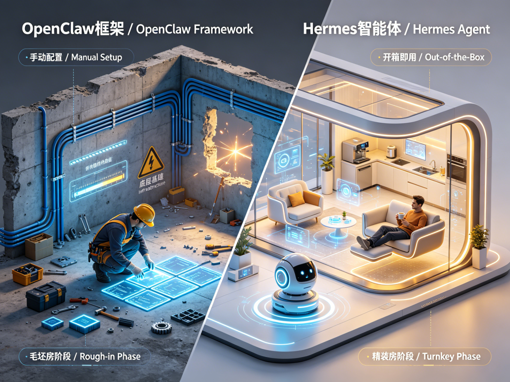
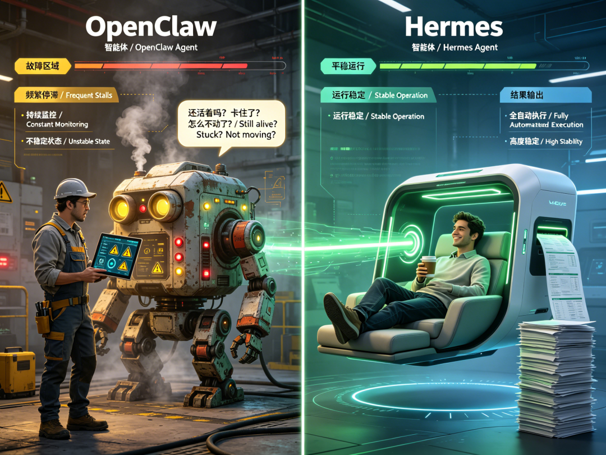
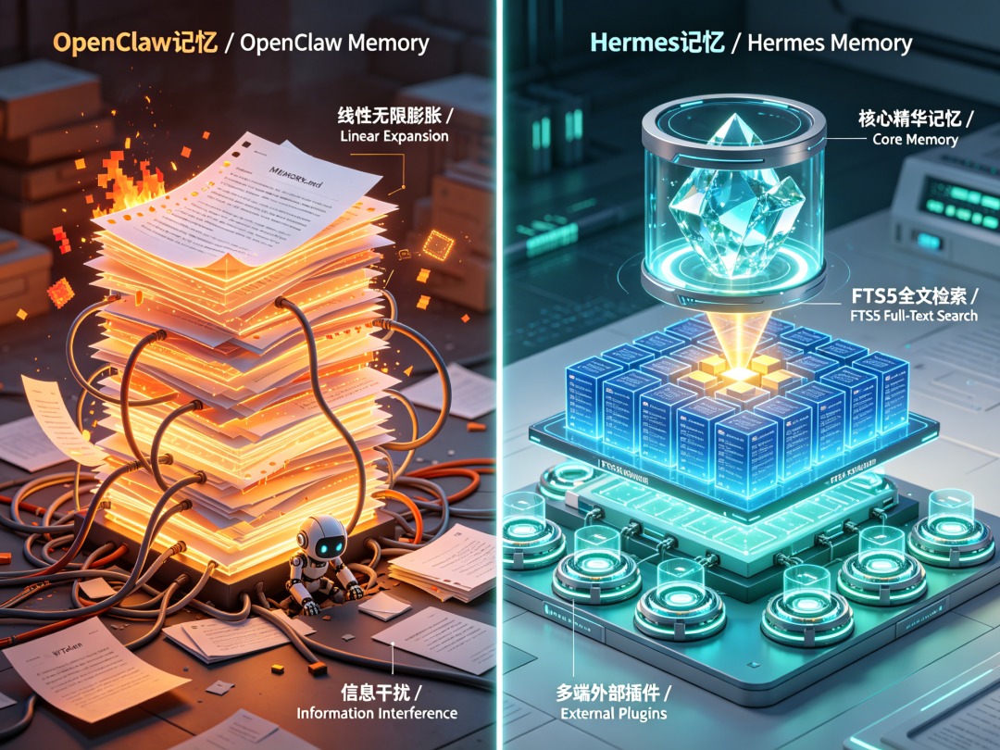
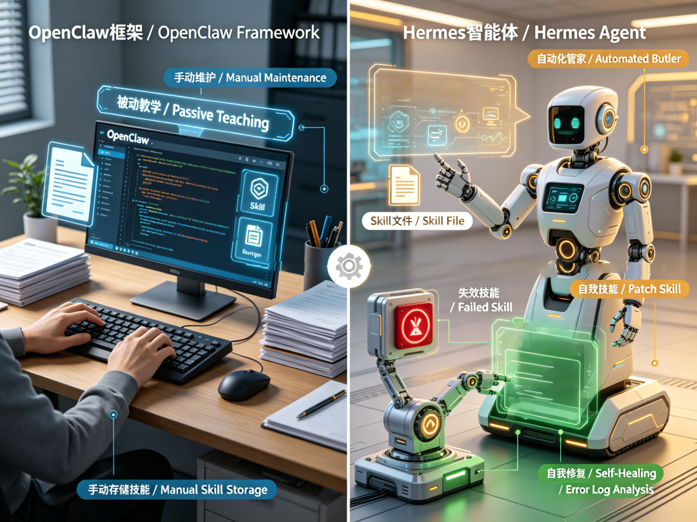
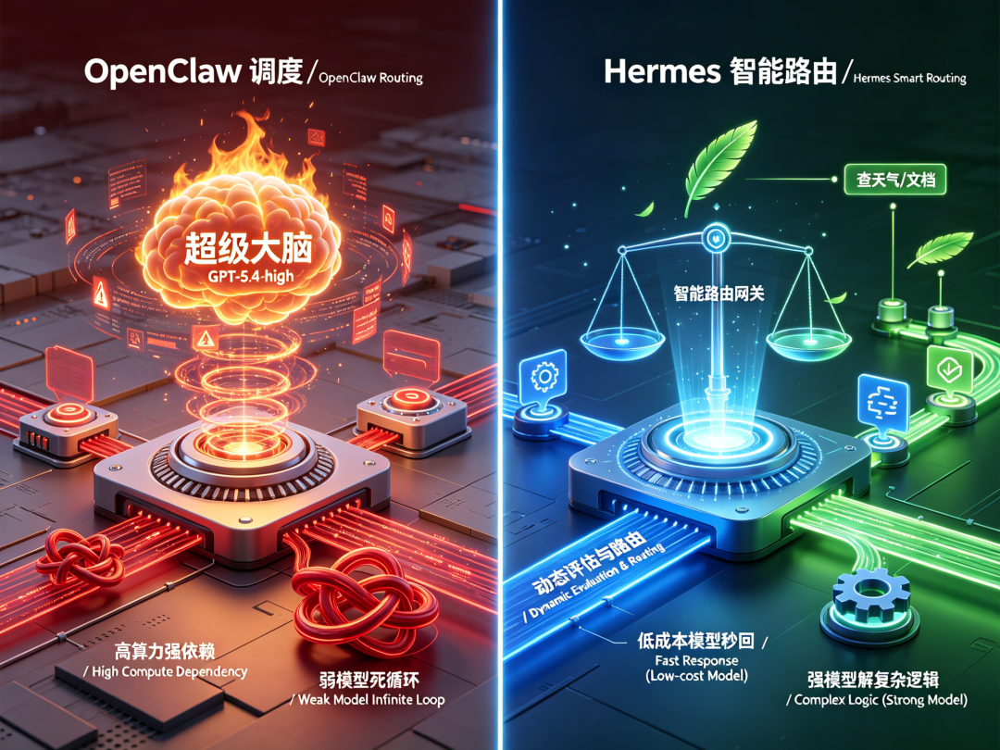
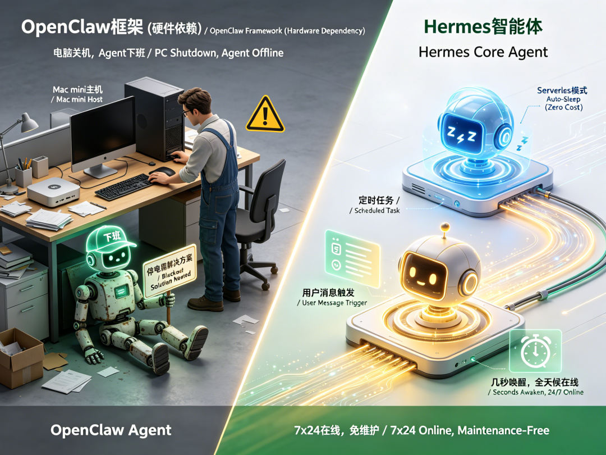
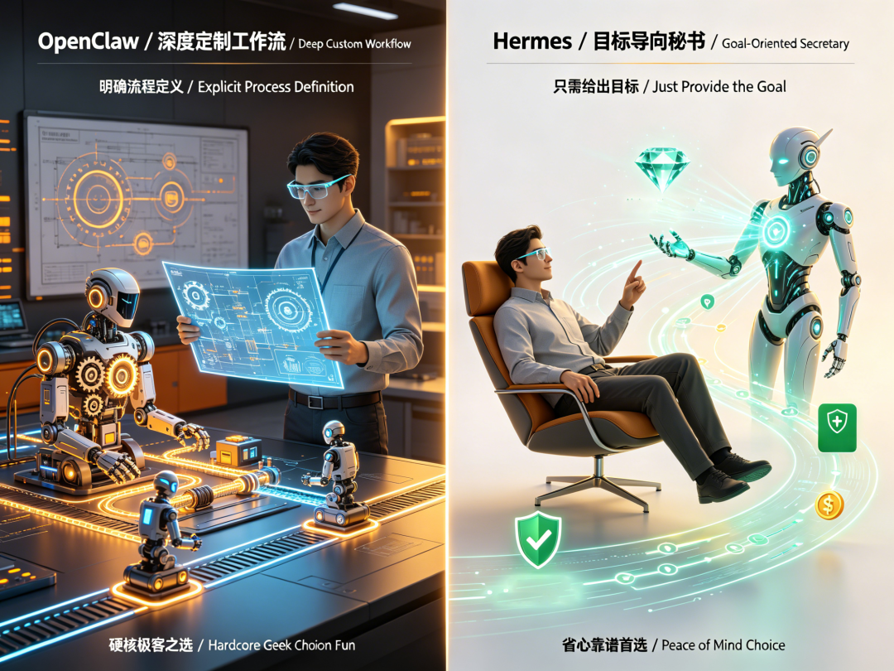

# 我把 openclaw 换成了 hermes，龙虾圈的"爱马仕"了解下

- 作者：尹浩伊
- 发布时间：2026-04-10 22:52
- 摘要：年前 OpenClaw 火的时候我就入坑了，前前后后用了三个月。搭 Telegram bot，跑各种自动化，确实好玩。

年前 OpenClaw 火的时候我就入坑了，前前后后用了三个月。搭 Telegram bot，跑各种自动化，确实好玩。但最近试了 Hermes Agent，用了几天就把主力切过去了。

OpenClaw 像是个毛坯房的地基。墙砌好了，水电通了，能住。但要住得舒服，得自己铺地板、装锁、配家具。每次系统升级，还得小心翼翼别把刚接好的管子砸了。

Hermes 则是精装房。开箱即用，地板灯光家电全有，物业还自带个会自己修东西的管家。



这不算捧一踩一，主要是定位不同。深度用了几天，整理几个 Hermes 真正有而 OpenClaw 原生没有的东西。

# 一、长任务不"失联"

我迁移的最直接原因就是稳定性。

OpenClaw 跑长流程的时候，我经常得去问它："还活着吗？" "卡住了？" "怎么不动了？"。它就像个干活还行但总得盯着的实习生。

Hermes 稳很多。工具链调用和长任务基本不用管，跑完直接出结果。除了重启 Gateway 会断一下，平时基本不丢状态。



对这种要 7x24 在线的 agent，"稳"比什么花里胡哨的功能都管用。

# 二、记忆系统：记事本 vs. 数据库

OpenClaw 的记忆系统其实不差。它会自动往 MEMORY.md 里追加内容，社区还有 QMD 这样的插件可以实现混合搜索。

但问题是，OpenClaw 的记忆本质上是一个不断增长的 Markdown 文件。时间一长，几千行的内容每次都要塞进 prompt，烧 token 不说，信息之间还容易互相干扰。

Hermes 的记忆分三层：

核心记忆：MEMORY.md 有严格字数限制，逼着 agent 只记最精华的事实，满了自动合并，不会无限膨胀。

FTS5 搜索：所有对话存在 SQLite 数据库里，带全文索引。你问"上次 Docker 网络怎么配的？"，它能精准定位到那天的对话，总结出命令，过滤掉废话。

外部插件：内置了 8 个记忆后端（Honcho、Mem0 等），跟核心记忆并行运行，互不冲突。



OpenClaw 像个记事本，越往后越难翻。Hermes 是"精华速查 + 全文检索"，越用越准。

# 三、技能进化：从"手动存档"到"自动进化"

这是最像"管家"的地方。

OpenClaw 也能存技能，但通常是"你教它"——"把这步记下来"，或者装插件来捕获上下文。

Hermes 是主动式的：

自动沉淀 SOP：当你跑完一个复杂任务（比如部署环境、跑通工作流），它发现流程比较固定，会主动弹出来问："这步很关键，下次可能还要用，存个技能？"你点个头，它就自动写好带有触发词和执行步骤的 Skill 文件。

自我修复 (Self-Healing)：这是最让我惊喜的。如果以后网页改版或者环境变化，导致某个技能失效报错了，Hermes 不会傻等。它能分析错误日志，自己把 Skill 文件里的代码 patch 修好。

不用你动手维护，技能库自己会生长，也会自己治病。



# 四、自带"精算师"，模型费省一半

之前用 OpenClaw，得上 Opus 4.6 或者 GPT-5.4-high 才能丝滑跑。模型一换弱，工具调用就开始飘，经常跑着跑着就卡在循环里。

Hermes 对模型要求低很多，我现在日常用 qwen3.6-plus，任务交付能力依然很强。

更赞的是它有个智能模型路由。你可以在后台配好规则：简单的查天气、查文档，它自动用便宜模型秒回；遇到写代码、逻辑推理，它会自动切到强模型。你不用每次手动切，它自己会算这笔账，既保证质量又帮你省钱。



# 五、自带"后悔药"，改错代码不怕

程序员最怕什么？Agent 一顿操作猛如虎，代码改坏了回不去。

Hermes 在后台默默做了文件级自动快照（Checkpoint）。每次执行破坏性操作前，它会自动打个 Git 快照。如果它把代码改崩了，或者文件搞乱了，你随时可以一条命令回滚到操作前的状态。

OpenClaw 没有这个机制，改错了只能靠你自己手动恢复。有了这个"后悔药"，敢让 Agent 放开手脚干很多事。

# 六、能"摇人"，还能自己特训

OpenClaw 也能调用子代理，但得你自己折腾配置。Hermes 的玩法更多，而且开箱即用：

Mixture of Agents (MoA)：遇到复杂问题，它能同时调用三个不同的模型分别干活（比如一个查资料、一个写代码、一个做检查），最后汇总出最佳答案。相当于你雇了个项目经理，手下带着一队专家。

RL 训练：这是最硬核的。它能把和你交互的过程变成训练数据，支持自己跑强化学习（RL），训练出更强、更适合你的下一代模型。它不只是一个工具，更是一个会自我进化的系统。

# 七、部署：云端常驻，按需花钱

OpenClaw 以前主要跑在 Mac mini，电脑一关 agent 就下班了。想全天候在线，就得找到停电的解决方案。

Hermes 原生支持 Serverless 模式（Daytona / Modal）。Agent 不用时会自动休眠，几乎零成本；有人发消息或者定时任务到了，几秒钟唤醒开工。真正的 7x24 在线，不用自己维护服务器环境。



# 八、数字员工 vs. 私人秘书

OpenClaw 非常适合做深度定制的工作流。如果你清楚自己想要什么，能用插件和配置搭出一个高度自动化的数字员工，效率很高。

Hermes 更像是有手脚的私人秘书。你不需要把流程定义死，告诉它目标就行。它自己拆解步骤、调用工具、把活干完，过程中出了问题还能自己想办法补救。

想折腾细节、享受配置乐趣的，OpenClaw 依然好用。想省心、长任务靠谱、API 费还少、自带"后悔药"的，Hermes 是目前开源圈里最好的选择。



# 迁移

从 openclaw 迁移过来很简单，内置了命令：

```
hermes claw migrate --dry-run （先预览）
```

```
hermes claw migrate （执行）
```

SOUL.md（人格）、MEMORY.md（记忆）、自定义技能、API 密钥、消息平台配置，全部自动导过去。跑起来跟原来一样，慢慢就会发现多出来的那些功能。
